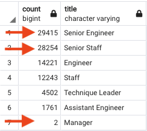
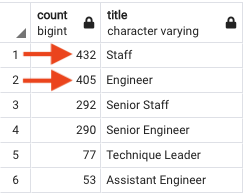
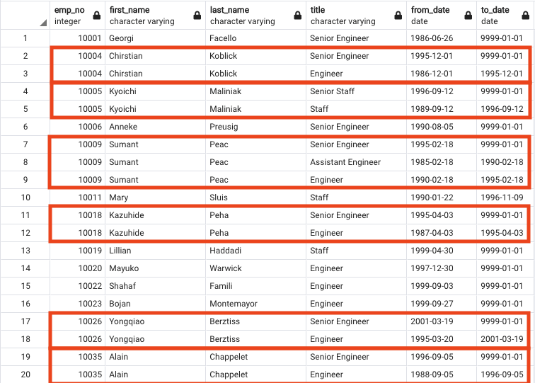
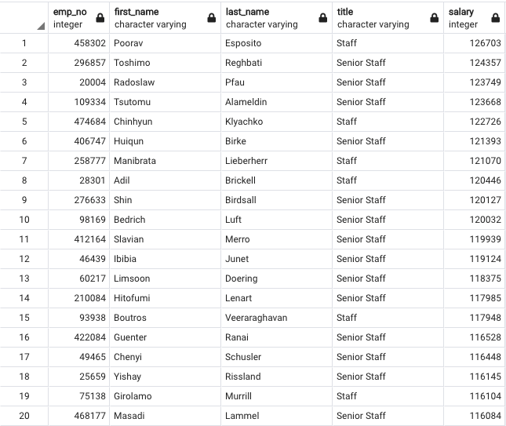

# Pewlett-Hackard-Analysis
## Overview of the Analysis
Pewlett Hackard’s Human Recourses department is preparing for the “silver tsunami” or several employees retiring in the near future but are unsure how many employees or which departments would be affected the most. In light of these upcoming retirements, HR is considering a mentorship program and wanted to get a better idea of which employees would be good candidates for mentoring.  By utilizing Structured Query Language or SQL and applying it to Pewlett Hackard’s employee data, I could provide the HR team with insight on employee retirement by title and eligible employees for the mentorship program.

## Results
After preforming the analysis on Pewlett Hackard’s employee data, four major conclusions could be drawn.

- Pewlett Hackard titles with the most employees eligible for retirement in the rear future are by far the Senior Engineers (29,415) and Senior Staffer (28,254).
- Only two managers at Pewlett Hackard are eligible for retirement in the rear future which is considerably less than many of the other titles.  This could be because there are far less managers at the company than there are engineers or general staff.

- Luckily for Pewlett Hackard, the employee titles that have the greatest number of employees eligible for the mentorship program are by far General Staffers (432) and Engineers (405).

- By analyzing the retirement_titles table, we noticed a large number of employees mentioned several times.  We had the clean up this data for the final analysis but it’s important to mention that a large amount of the workforce has been with Pewlett Hackard for a very long time and as a result, these employees have worked their way up and received promotions.  The mentorship program sounds like a great idea and will hopefully continue the trend of junior employees staying with the company.

## Summary
- Pewlett Hackard will need to start thinking about the future of the company because a total of 90,398 employee roles will need to be filed as the “silver tsunami” begins to make an impact.  By creating a new SQL query, we can also analyze the salaries of the senior employees and estimate the amount of money that will potentially be available to the company after the "silver tsunami" for investingfor the future.

- Pewlett Hackard is in good position when it comes to training the junior employees for the mentorship program.  By creating a new table based on employees that are elegiable for the mentorship program, Pewlett Hackard has 1,549 junior employees eligible for the mentorship program and 90,398 senior employees over a variety of different departments retiring in the near future.

